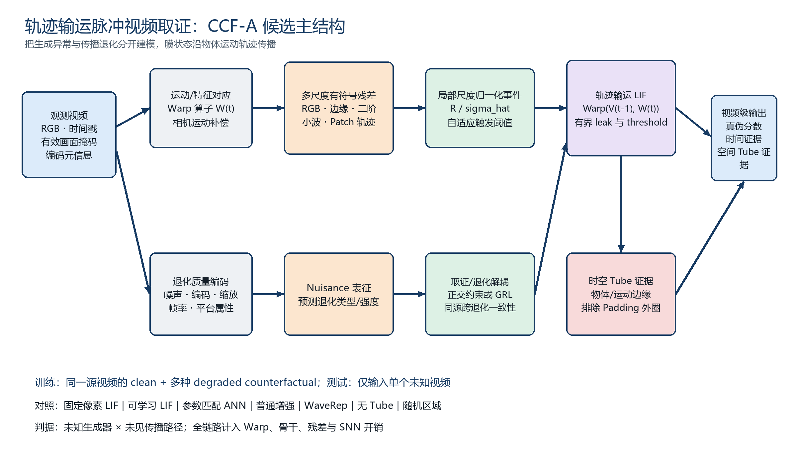
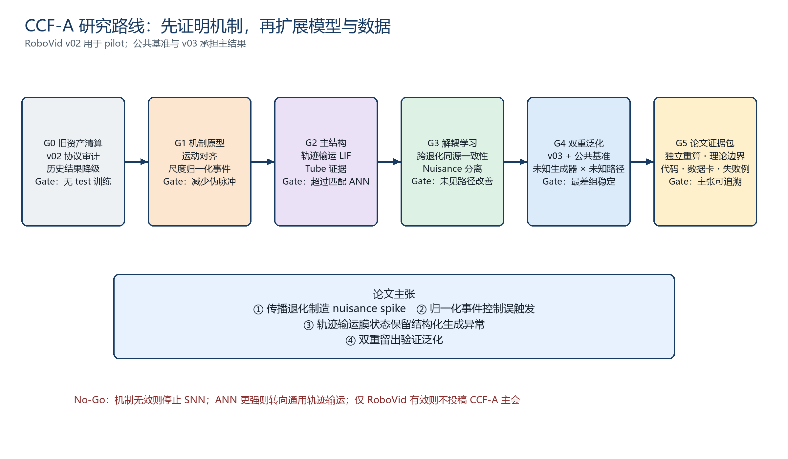

# 面向 CCF-A 的视频级算法创新路线

> 本文为上一轮候选草案。2026-09-07 反方审查撤回了对单独 Warp-LIF、尺度归一化和 GRL 创新强度的乐观判断；最新方案与执行依据为 [ADVERSARIAL_REVIEW_2026-09-07.md](ADVERSARIAL_REVIEW_2026-09-07.md)。下文的机制和理论均未获得真实视频实验验证，旧图不代表已确定的最终架构。

## 研究定位

工作题目：**Degradation-Disentangled Trajectory-Transport Spiking Forensics for AI-Generated Video Detection**。

中文：**面向传播退化的轨迹输运脉冲视频取证**。

主问题：给定经过未知压缩、缩放、帧率变化、噪声或平台转码的视频，如何把生成过程留下的结构化时序异常，与传播过程新引入的随机或编码异常分离，并在未知生成器上保持可靠检测？

已有论文只提供方向片段：MAST 提供伪事件和通道 LIF；Spike-BRGNet 提供事件边界与多尺度思路；团队旧工作提供退化干预资产。新论文的核心必须由新的模型、机制证据和严格协议共同构成。

## 核心算法假设

观测视频记为 `Y_t = D(X_t)`，其中 `D` 是未知传播退化。普通帧差混合了自然运动、生成异常和传播噪声：

`Y_t - Y_(t-1) = motion + generation artifact + degradation artifact`。

第一步用运动或特征对应关系 `W_t` 对齐前一帧，再计算残差：

`R_t = Y_t - Warp(Y_(t-1), W_t)`。

第二步估计每个位置、尺度和通道的局部 nuisance scale `sigma_hat`，产生归一化有符号事件：

`E_t = sign(R_t) * ReLU(|R_t| / (sigma_hat + eps) - kappa)`。

这一步把固定阈值改为数据驱动阈值。在次高斯噪声近似下，可尝试证明噪声触发事件的概率随 `kappa` 指数下降；该结论必须在真实平台残差上验证适用范围。

第三步让 SNN 的膜电位沿运动轨迹输运：

`V_t(p) = alpha_t(p) * Warp(V_(t-1), W_t)(p) + gate_t(p) * E_t(p)`。

传统 LIF 在固定像素位置累积；轨迹输运 LIF 沿物体运动保存状态。这个机制比“再加一个 SNN 分支”更具方法辨识度，也能直接检验运动补偿是否减少传播噪声与相机运动造成的伪脉冲。

第四步做 nuisance/forensic 解耦：

- forensic 分支预测真假，接受跨退化同源一致性约束；
- nuisance 分支预测退化类型、强度与编码属性；
- 使用正交约束或 gradient reversal 降低 forensic 表征中的退化可识别性；
- 保留参数匹配 ANN，对比收益究竟来自输运与归一化，还是来自脉冲神经元。

## 视频级模型架构

输入端同时保留 RGB、时间戳、有效画面 mask 和编码元信息。伪事件通道先采用：运动补偿 RGB 残差、边缘残差、二阶残差、小波带间残差、patch 位移和 patch 曲率。全部通道必须做 leave-one-out，不预设越多越好。

边界机制升级为**时空边界管道**：先得到物体/运动边缘，再通过对应关系把边缘沿时间连接成 tube。模型比较 tube 内持续事件、tube 外随机事件和固定画面外圈。若 tube 不优于等面积随机区域，删除该分支。

输出包括视频真假分数、时间片段证据、空间 tube 证据、通道可靠性、脉冲率和退化预测。没有像素级真值前统一称 evidence map，不称伪造定位结果。

## 预期贡献层级

| 层级 | 候选贡献 | CCF-A 所需证据 |
|---|---|---|
| 机制 | 传播退化如何改变伪事件密度、阈值越界与膜状态 | 同视频受控干预、真实平台外部验证、生成器分层统计 |
| 方法 | 轨迹输运 LIF + 局部尺度归一化事件 | 固定像素 LIF、普通 RNN/Transformer、参数匹配 ANN 消融 |
| 学习 | nuisance/forensic 解耦与跨退化同源一致性 | 未见退化优于普通增强、无明显 clean 性能交换 |
| 解释 | 时空边界 tube 中的持续取证事件 | 随机区域、固定外圈、padding mask、运动强度匹配对照 |
| 评测 | 未知生成器 × 未见传播路径双重留出 | 公共 benchmark、独立 real source、multi-seed 与区间 |

仅仅实现 conditional threshold 或把 Spike-BRGNet 三分支移到视频分类，创新强度不足。建议把“膜状态随运动轨迹输运”作为主结构，把“退化归一化事件”作为主理论点，把“解耦训练”作为提升泛化的学习策略。

## 数据与协议重建

RoboVid-SM v02 作为 pilot；建立 v03：

1. 至少覆盖 6–10 个生成器，按生成器整体留出，不把同一生成器随机分散到三套 split。
2. 至少两个独立真实来源；做 real-vs-real 分类器检查来源捷径。
3. 保留语义对齐子集用于机制分析；随机配对子集只能用于普通分类，不声称内容控制。
4. 每个源视频产生多个退化视图，并以 `parent_video_id` 分组，任何同源视图不能跨 split。
5. 原始轨道与 canonical re-encode 审计轨道并行；统一重编码结果不能替代原始视频结果。
6. 真实平台子集记录上传设备、客户端版本、时间、下载方式、原始/输出 SHA256 与失败样本。

主 benchmark 建议组合：GenVideo 或 GenVidBench 用于训练与跨生成器；AIGVDBench 或 RA-Bench 用于跨数据集；RoboVid v03 用于受控传播路径；真实 WeChat/WhatsApp 子集用于外部校验。数据许可与下载状态需单独审计。

## 基线与评测

核心基线：ReStraV、D3、DeMamba、WaveRep、MAST、Native-Scale；资源允许时加入 NSG-VD。所有模型统一帧采样、样本集合和指标；原作者专属协议另表报告。

方法对照：

- raw residual + ANN；
- motion-aligned residual + ANN；
- fixed-pixel LIF；
- learnable LIF；
- transported LIF；
- transported LIF + adaptive event normalization；
- 完整 nuisance disentanglement；
- 参数匹配 dense temporal model。

主指标：macro AUROC、worst-generator AUROC、worst-path AUROC、BAcc、Fake Recall、ECE、clean-to-degraded paired drop。报告 3–5 seeds 与按源视频分组 bootstrap 区间。最终门槛在 test 前冻结。

效率必须报告解码、运动估计、语义骨干和 SNN 全链路延迟。若光流抵消 SNN 节能优势，可改用低成本 block motion vector 或 patch correspondence；不能仅报告 SNN 子模块 SOP。

## Goal–Milestone

| Milestone | 交付物 | 进入下一阶段的门槛 |
|---|---|---|
| G0 旧资产清算 | v02 审计、统一标签和 held-out pilot | 明确哪些旧结果作废，主协议不再复用 test 训练 |
| G1 机制原型 | 噪声归一化事件、运动对齐、tube 对照 | 至少两个生成器上降低伪脉冲且保留真假间距 |
| G2 主结构 | transported LIF 与参数匹配 ANN | 增益来自输运机制；固定 LIF 和 ANN 对照齐备 |
| G3 解耦学习 | paired-view + nuisance/forensic | 未见路径改善，clean 性能损失在冻结范围内 |
| G4 v03 与公共评测 | 双重留出、跨数据集、真实平台 | worst-group 增益稳定，区间和失败案例完整 |
| G5 规模化与论文 | 代码、数据卡、模型卡、理论与可视化 | 独立复核可重算主表；论文主张逐项有证据 |

Go/No-Go 条件：G1 若运动对齐和尺度归一化均不能减少 nuisance spike，则停止 SNN 主线；G2 若参数匹配 ANN 持续优于 SNN，则论文转向通用轨迹输运取证，不强保留 SNN；G4 若只在 RoboVid 有效，则不能冲击 CCF-A 主会。

## 投稿叙事

优先按 CVPR/ICCV 风格组织：一个明确视觉问题、一个可画清楚的核心算子、一组跨生成器与跨传播路径结果、一套机制可视化。若形成严格概率界和系统的表示解耦，可同时评估 NeurIPS 路线。

论文主张应收敛到三项：

1. 固定像素伪事件在传播退化下产生 nuisance spike；
2. 局部尺度归一化与轨迹输运膜状态能够稳定保存生成异常；
3. 这种机制在未知生成器和未见传播路径上优于相同增强、相同骨干和相同参数预算的替代方案。

RoboVid 不再作为论文的主要创新，而是服务于机制验证。旧论文的低质量不会限制新工作，只要新项目从数据协议、算法实现和证据链重新建立。
